```{r setup, include=FALSE}
knitr::opts_chunk$set(echo = FALSE)
library(htmltools)
```

This page lists supplementary materials associated with my paper,
[The Life and Works of André-Michel Guerry, Revisited](GuerryLife3.pdf),
in press, [Sociological Spectrum](https://www.tandfonline.com/journals/usls20), accepted April, 2022,
[DOI](10.1080/02732173.2022.2078450).

It includes Guerry's works on moral statistics, often difficult to find,
and several related papers by Quetelet and others.
In addition, English translations are provided for a few of these.

## Earlier papers on Guerry

<div style="text-align:center">
<a href="http://www.datavis.ca/papers/guerry-STS241.pdf">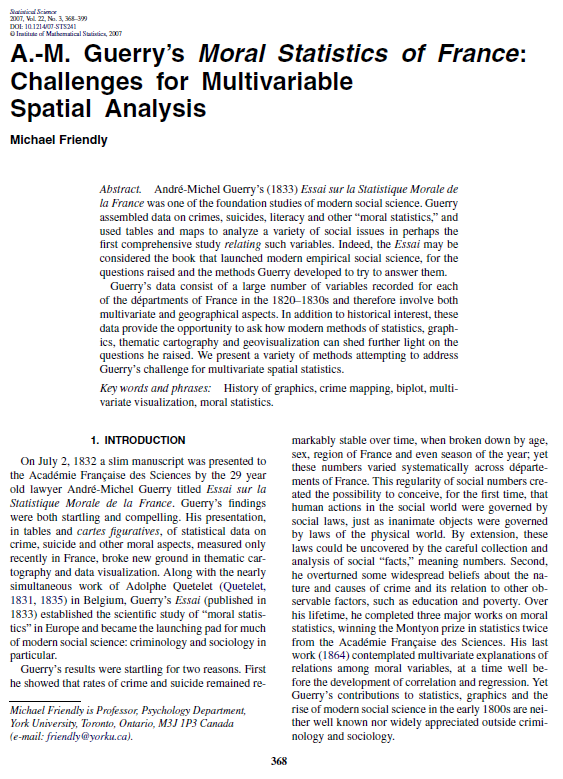</a>
<a href="A.M.Guerry-Tours.pdf">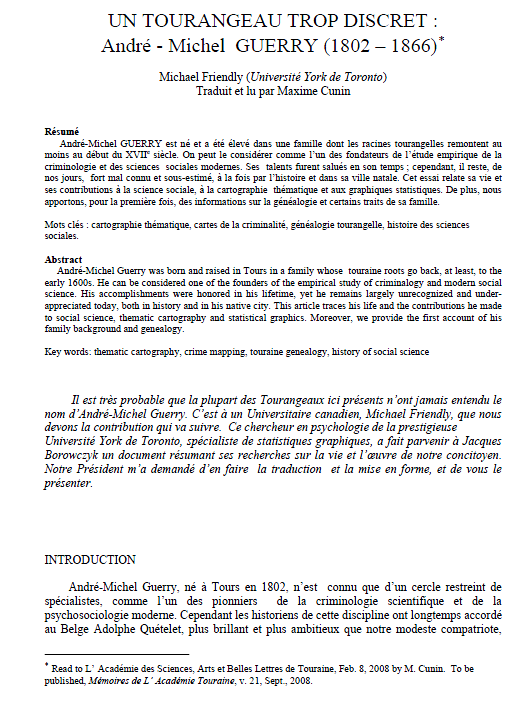
<a href="https://www.datavis.ca/papers/ordonnateur/ordonnateur-published.pdf">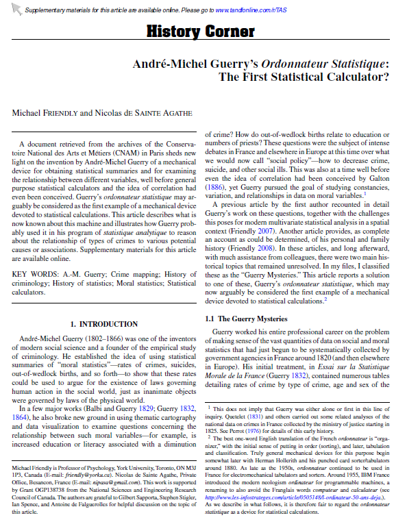
</div>


<!-- {height=200px}  -->
<!-- {height=200px} -->

* Friendly, M. (2007) [A.-M. Guerry’s Moral Statistics of France: Challenges for Multivariable Spatial Analysis.](http://www.datavis.ca/papers/guerry-STS241.pdf) 
_Statistical Science_, **22**, 368–399.
  + [Supplementary materials for this paper](https://www.datavis.ca/gallery/guerry/)

* Friendly, M. (2007) [The Life and Works of André-Michel Guerry (1802-1866).](GuerryLife.pdf)

* Friendly, M. (2008) [Un Tourangeau Trop Discret: André-Michel GUERRY (1802-1866).](A.M.Guerry-Tours.pdf)
_Mémoires De l’Academié De Touraine_, **XXI**, 213–231.

* Friendly, M., & de Saint Agathe. (2012). [André-Michel Guerry’s Ordonnateur Statistique: The First Statistical Calculator?](https://www.datavis.ca/papers/ordonnateur/ordonnateur-published.pdf)
_The American Statistician_, **66**, 195–200. DOI: <https://doi.org/10.1080/00031305.2012.714716>.

## Guerry's Works

<div style="text-align:center">
<a href="Balbi_Guerry-1829.jpg">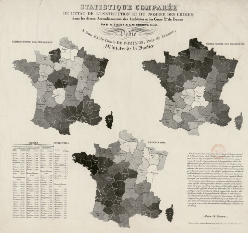</a>
<a href="Guerry1832-motives.pdf">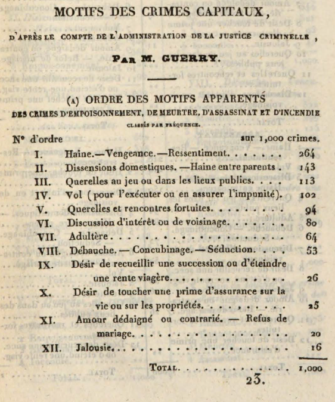</a>
<a href="Guerry1832-instruction-crime.pdf">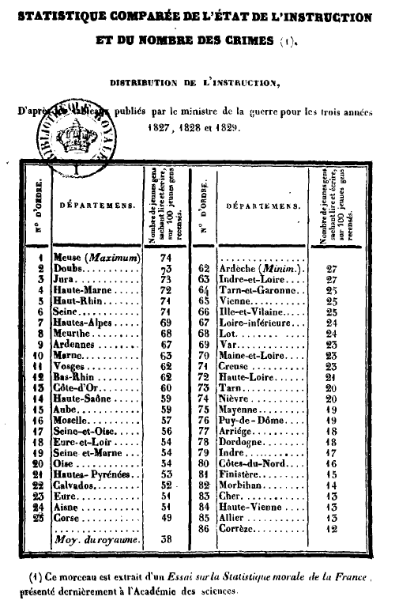</a>
<a href="Guerry1833-Whitt-translation.pdf">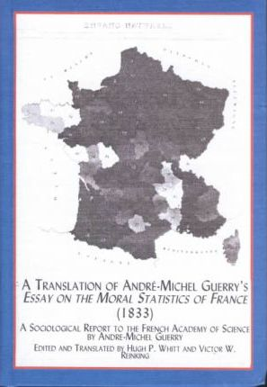</a>
<a href="Guerry1864-2-introduction.pdf">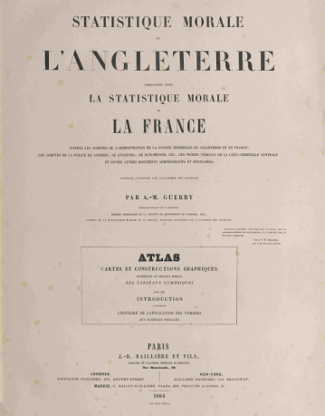</a>
</div>

* Balbi, A., & Guerry, A.-M. (1829). [Statistique comparée de l’état de l’instruction et du nombre des crimes dans les divers arrondissements des Académies et des Cours Royales de France.](Balbi_Guerry-1829.jpg) Paris: Jules Renouard. 

* Guerry, A.-M. (1829). [Tableau des Variations météorologique comparées aux phénomènes physiologiques, d’aprés les observations faites à l’Obervatoire royal, et les recherches statistique les plus récentes.](Guerry1829-variations.pdf) 
_Annales d’Hygiène Publique et de Médecine Légale_, **1**, 228–237.

* Guerry, A.-M. (1832). [Motifs des crimes capitaux, d'apres le compte de l'administration de la justice criminelle.](Guerry1832-motives.pdf),
_Annales d’Hygiène Publique et de Médecine Légale_, **8**, 335–346. [English translation](Guerry1832-motives-English.docx)

* Guerry, A.-M. (1832). [Statistique comparée de l'état de l'instruction et du nombre des crimes.](Guerry1832-instruction-crime.pdf)
Paris: Everat. [English translation](Guerry1832-instruction-crime-English.docx)

* Guerry, A.-M. (1833). _Essai sur la statistique morale de la France_. Paris: Crochard.
  + [English translation](Guerry1833-Whitt-translation.pdf): Hugh P. Whitt and Victor W. Reinking, Lewiston, N.Y.: Edwin Mellen Press, 2002.
  + Whitt, H. (2002). [Inventing Sociology: André-Michel Guerry and the _Essai sur la statistique morale de la France_.](Guerry1833-Whitt-intro.pdf)
  
* Guerry, A.-M. (1864). _Statistique morale de l’Angleterre comparée avec la statistique morale de la France, d’après les comptes de l’administration de la justice criminelle en Angleterre et en France, etc._ 
Paris: J.-B. Baillière et fils. 
  * 1 [Extrait	du rapport sur le concours pour le prix de statistique (1860), Fondation Montyon.](Guerry1864-1-reports.pdf)
  * 2 [Introduction contenant l'histoire de l'application des nombres aux sciences morales.](Guerry1864-2-introduction-reduced.pdf)
  * 3 [Motifs des attentats a la vie.](Guerry1864-3-motives.pdf)
  * 4 [Plates.](Guerry1864-4-plates.pdf)

## Other

<div style="text-align:center">
<a href="Isambert-Guerry.pdf">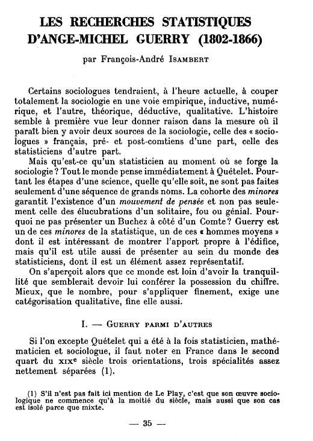</a>
<a href="Quetelet1831-translation.pdf">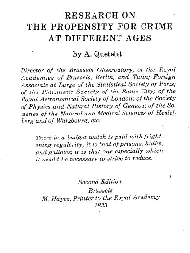</a>
<a href="Quetelet1831-growth.pdf">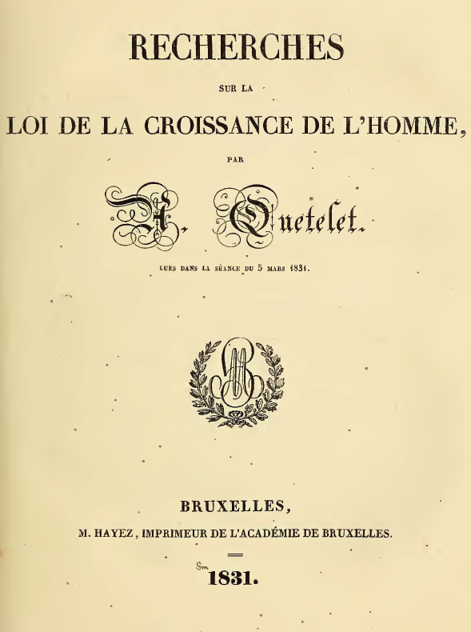</a>
</div>

* Isambert, F.-A. (1969). [Les Recherches Statistiques d’Ange-Michel Guerry.](Isambert-Guerry.pdf) 
_Cahiers Internationaux De Sociologie_, **47**, 35–44.
  + [English translation](Isambert-English.docx).

* Quetelet, A. (1831). [Recherches sur le penchant au crime aux différents âges.](Quetelet1831-crime.pdf)
  + [English translation](Quetelet1831-translation.pdf)

* Quetelet, A. (1831). [Recherches sur la Loi de la Croissance de l’Homme.](Quetelet1831-growth.pdf)


